# Projects and dependencies analysis

This document provides a comprehensive overview of the projects and their dependencies in the context of upgrading to .NETCoreApp,Version=v10.0.

## Table of Contents

- [Executive Summary](#executive-Summary)
  - [Highlevel Metrics](#highlevel-metrics)
  - [Projects Compatibility](#projects-compatibility)
  - [Package Compatibility](#package-compatibility)
  - [API Compatibility](#api-compatibility)
- [Aggregate NuGet packages details](#aggregate-nuget-packages-details)
- [Top API Migration Challenges](#top-api-migration-challenges)
  - [Technologies and Features](#technologies-and-features)
  - [Most Frequent API Issues](#most-frequent-api-issues)
- [Projects Relationship Graph](#projects-relationship-graph)
- [Project Details](#project-details)

  - [AspNetCore.Identity.FlexDb.Tests\AspNetCore.Identity.FlexDb.Tests.csproj](#aspnetcoreidentityflexdbtestsaspnetcoreidentityflexdbtestscsproj)
  - [AspNetCore.Identity.FlexDb\AspNetCore.Identity.FlexDb.csproj](#aspnetcoreidentityflexdbaspnetcoreidentityflexdbcsproj)
  - [Common.Tests\Cosmos.Common.Tests.csproj](#commontestscosmoscommontestscsproj)
  - [Common\Cosmos.Common.csproj](#commoncosmoscommoncsproj)
  - [Cosmos.BlobService\Cosmos.BlobService.csproj](#cosmosblobservicecosmosblobservicecsproj)
  - [Cosmos.ConnectionStrings\Cosmos.DynamicConfig.csproj](#cosmosconnectionstringscosmosdynamicconfigcsproj)
  - [Cosmos.EmailServices\Cosmos.EmailServices.csproj](#cosmosemailservicescosmosemailservicescsproj)
  - [Cosmos.MicrosoftGraph\Cosmos.MicrosoftGraph.csproj](#cosmosmicrosoftgraphcosmosmicrosoftgraphcsproj)
  - [Editor\Sky.Editor.csproj](#editorskyeditorcsproj)
  - [Publisher\Sky.Publisher.csproj](#publisherskypublishercsproj)
  - [Sky.Cms.Api.Shared\Sky.Cms.Api.Shared.csproj](#skycmsapisharedskycmsapisharedcsproj)
  - [Sky.Shared.Razor\Sky.Shared.Razor.csproj](#skysharedrazorskysharedrazorcsproj)
  - [Sky.TestSetup\Sky.TestSetup.csproj](#skytestsetupskytestsetupcsproj)
  - [Tests\Sky.Tests.csproj](#testsskytestscsproj)

## Executive Summary

### Highlevel Metrics

| Metric | Count | Status |
| :--- | :---: | :--- |
| Total Projects | 14 | All require upgrade |
| Total NuGet Packages | 64 | 30 need upgrade |
| Total Code Files | 1169 |  |
| Total Code Files with Incidents | 115 |  |
| Total Lines of Code | 228873 |  |
| Total Number of Issues | 527 |  |
| Estimated LOC to modify | 471+ | at least 0.2% of codebase |

### Projects Compatibility

| Project | Target Framework | Difficulty | Package Issues | API Issues | Est. LOC Impact | Description |
| :--- | :---: | :---: | :---: | :---: | :---: | :--- |
| [AspNetCore.Identity.FlexDb.Tests\AspNetCore.Identity.FlexDb.Tests.csproj](#aspnetcoreidentityflexdbtestsaspnetcoreidentityflexdbtestscsproj) | net9.0 | 🟢 Low | 3 | 1 | 1+ | DotNetCoreApp, Sdk Style = True |
| [AspNetCore.Identity.FlexDb\AspNetCore.Identity.FlexDb.csproj](#aspnetcoreidentityflexdbaspnetcoreidentityflexdbcsproj) | net9.0 | 🟢 Low | 5 | 4 | 4+ | ClassLibrary, Sdk Style = True |
| [Common.Tests\Cosmos.Common.Tests.csproj](#commontestscosmoscommontestscsproj) | net9.0 | 🟢 Low | 1 | 35 | 35+ | DotNetCoreApp, Sdk Style = True |
| [Common\Cosmos.Common.csproj](#commoncosmoscommoncsproj) | net9.0 | 🟢 Low | 2 | 25 | 25+ | ClassLibrary, Sdk Style = True |
| [Cosmos.BlobService\Cosmos.BlobService.csproj](#cosmosblobservicecosmosblobservicecsproj) | net9.0 | 🟢 Low | 0 | 13 | 13+ | ClassLibrary, Sdk Style = True |
| [Cosmos.ConnectionStrings\Cosmos.DynamicConfig.csproj](#cosmosconnectionstringscosmosdynamicconfigcsproj) | net9.0 | 🟢 Low | 2 | 33 | 33+ | ClassLibrary, Sdk Style = True |
| [Cosmos.EmailServices\Cosmos.EmailServices.csproj](#cosmosemailservicescosmosemailservicescsproj) | net9.0 | 🟢 Low | 3 | 4 | 4+ | ClassLibrary, Sdk Style = True |
| [Cosmos.MicrosoftGraph\Cosmos.MicrosoftGraph.csproj](#cosmosmicrosoftgraphcosmosmicrosoftgraphcsproj) | net9.0 | 🟢 Low | 11 | 19 | 19+ | ClassLibrary, Sdk Style = True |
| [Editor\Sky.Editor.csproj](#editorskyeditorcsproj) | net9.0 | 🟡 Medium | 6 | 220 | 220+ | AspNetCore, Sdk Style = True |
| [Publisher\Sky.Publisher.csproj](#publisherskypublishercsproj) | net9.0 | 🟢 Low | 5 | 28 | 28+ | AspNetCore, Sdk Style = True |
| [Sky.Cms.Api.Shared\Sky.Cms.Api.Shared.csproj](#skycmsapisharedskycmsapisharedcsproj) | net9.0 | 🟢 Low | 0 | 7 | 7+ | AspNetCore, Sdk Style = True |
| [Sky.Shared.Razor\Sky.Shared.Razor.csproj](#skysharedrazorskysharedrazorcsproj) | net9.0 | 🟢 Low | 1 | 0 |  | ClassLibrary, Sdk Style = True |
| [Sky.TestSetup\Sky.TestSetup.csproj](#skytestsetupskytestsetupcsproj) | net9.0 | 🟢 Low | 1 | 0 |  | DotNetCoreApp, Sdk Style = True |
| [Tests\Sky.Tests.csproj](#testsskytestscsproj) | net9.0 | 🟢 Low | 2 | 82 | 82+ | DotNetCoreApp, Sdk Style = True |

### Package Compatibility

| Status | Count | Percentage |
| :--- | :---: | :---: |
| ✅ Compatible | 34 | 53.1% |
| ⚠️ Incompatible | 4 | 6.3% |
| 🔄 Upgrade Recommended | 26 | 40.6% |
| ***Total NuGet Packages*** | ***64*** | ***100%*** |

### API Compatibility

| Category | Count | Impact |
| :--- | :---: | :--- |
| 🔴 Binary Incompatible | 96 | High - Require code changes |
| 🟡 Source Incompatible | 212 | Medium - Needs re-compilation and potential conflicting API error fixing |
| 🔵 Behavioral change | 163 | Low - Behavioral changes that may require testing at runtime |
| ✅ Compatible | 278201 |  |
| ***Total APIs Analyzed*** | ***278672*** |  |

## Aggregate NuGet packages details

| Package | Current Version | Suggested Version | Projects | Description |
| :--- | :---: | :---: | :--- | :--- |
| AWSSDK.S3 | 4.0.18.4 |  | [Cosmos.BlobService.csproj](#cosmosblobservicecosmosblobservicecsproj) | ✅Compatible |
| Azure.Communication.Email | 1.1.0 |  | [Cosmos.EmailServices.csproj](#cosmosemailservicescosmosemailservicescsproj) | ✅Compatible |
| Azure.Extensions.AspNetCore.DataProtection.Blobs | 1.5.1 |  | [Cosmos.BlobService.csproj](#cosmosblobservicecosmosblobservicecsproj) | ✅Compatible |
| Azure.Identity | 1.17.0 |  | [Cosmos.EmailServices.csproj](#cosmosemailservicescosmosemailservicescsproj) [Cosmos.MicrosoftGraph.csproj](#cosmosmicrosoftgraphcosmosmicrosoftgraphcsproj) [Sky.Shared.Razor.csproj](#skysharedrazorskysharedrazorcsproj) | ⚠️NuGet package is deprecated |
| Azure.Monitor.Query | 1.7.1 |  | [Cosmos.Common.csproj](#commoncosmoscommoncsproj) | ⚠️NuGet package is deprecated |
| Azure.ResourceManager | 1.13.2 |  | [Sky.Editor.csproj](#editorskyeditorcsproj) | ✅Compatible |
| Azure.ResourceManager.Cdn | 1.5.1 |  | [Sky.Editor.csproj](#editorskyeditorcsproj) | ✅Compatible |
| Azure.Storage.Files.Shares | 12.25.0 |  | [Cosmos.BlobService.csproj](#cosmosblobservicecosmosblobservicecsproj) | ✅Compatible |
| BCrypt.Net-Next | 4.0.3 |  | [Sky.Editor.csproj](#editorskyeditorcsproj) | ✅Compatible |
| coverlet.collector | 6.0.4 |  | [AspNetCore.Identity.FlexDb.Tests.csproj](#aspnetcoreidentityflexdbtestsaspnetcoreidentityflexdbtestscsproj) [Cosmos.Common.Tests.csproj](#commontestscosmoscommontestscsproj) | ✅Compatible |
| coverlet.msbuild | 6.0.4 |  | [AspNetCore.Identity.FlexDb.Tests.csproj](#aspnetcoreidentityflexdbtestsaspnetcoreidentityflexdbtestscsproj) | ✅Compatible |
| CsvHelper | 33.1.0 |  | [Sky.Editor.csproj](#editorskyeditorcsproj) | ✅Compatible |
| Duende.IdentityServer.EntityFramework.Storage | 7.4.5 |  | [AspNetCore.Identity.FlexDb.csproj](#aspnetcoreidentityflexdbaspnetcoreidentityflexdbcsproj) | ✅Compatible |
| HtmlAgilityPack | 1.12.4 |  | [Cosmos.EmailServices.csproj](#cosmosemailservicescosmosemailservicescsproj) | ✅Compatible |
| IPAddressRange | 6.3.0 |  | [Cosmos.DynamicConfig.csproj](#cosmosconnectionstringscosmosdynamicconfigcsproj) | ✅Compatible |
| MailChimp.Net.V3 | 5.8.2 |  | [Cosmos.Common.csproj](#commoncosmoscommoncsproj) | ✅Compatible |
| MediatR | 14.0.0 |  | [Sky.Tests.csproj](#testsskytestscsproj) | ✅Compatible |
| Microsoft.AspNetCore.Authentication.Google | 9 | 10.0.5 | [Sky.Editor.csproj](#editorskyeditorcsproj) [Sky.Publisher.csproj](#publisherskypublishercsproj) | NuGet package upgrade is recommended |
| Microsoft.AspNetCore.Authentication.MicrosoftAccount | 9 | 10.0.5 | [Sky.Editor.csproj](#editorskyeditorcsproj) [Sky.Publisher.csproj](#publisherskypublishercsproj) | NuGet package upgrade is recommended |
| Microsoft.AspNetCore.Authorization | 9 | 10.0.5 | [Cosmos.MicrosoftGraph.csproj](#cosmosmicrosoftgraphcosmosmicrosoftgraphcsproj) | NuGet package upgrade is recommended |
| Microsoft.AspNetCore.DataProtection.EntityFrameworkCore | 9 | 10.0.5 | [Cosmos.Common.csproj](#commoncosmoscommoncsproj) | NuGet package upgrade is recommended |
| Microsoft.AspNetCore.Diagnostics.EntityFrameworkCore | 9 | 10.0.5 | [Sky.Publisher.csproj](#publisherskypublishercsproj) | NuGet package upgrade is recommended |
| Microsoft.AspNetCore.Identity.EntityFrameworkCore | 9 | 10.0.5 | [AspNetCore.Identity.FlexDb.csproj](#aspnetcoreidentityflexdbaspnetcoreidentityflexdbcsproj) | NuGet package upgrade is recommended |
| Microsoft.AspNetCore.Identity.UI | 9 | 10.0.5 | [Cosmos.EmailServices.csproj](#cosmosemailservicescosmosemailservicescsproj) | NuGet package upgrade is recommended |
| Microsoft.AspNetCore.Mvc.NewtonsoftJson | 9 | 10.0.5 | [Sky.Editor.csproj](#editorskyeditorcsproj) [Sky.Publisher.csproj](#publisherskypublishercsproj) | NuGet package upgrade is recommended |
| Microsoft.EntityFrameworkCore | 9.0.10 | 10.0.5 | [Cosmos.DynamicConfig.csproj](#cosmosconnectionstringscosmosdynamicconfigcsproj) | NuGet package upgrade is recommended |
| Microsoft.EntityFrameworkCore.Cosmos | 9.0.10 | 10.0.5 | [AspNetCore.Identity.FlexDb.csproj](#aspnetcoreidentityflexdbaspnetcoreidentityflexdbcsproj) [Cosmos.DynamicConfig.csproj](#cosmosconnectionstringscosmosdynamicconfigcsproj) | NuGet package upgrade is recommended |
| Microsoft.EntityFrameworkCore.InMemory | 9.0.10 | 10.0.5 | [Cosmos.Common.Tests.csproj](#commontestscosmoscommontestscsproj) [Sky.Tests.csproj](#testsskytestscsproj) | NuGet package upgrade is recommended |
| Microsoft.EntityFrameworkCore.Sqlite.Core | 9.0.10 | 10.0.5 | [AspNetCore.Identity.FlexDb.csproj](#aspnetcoreidentityflexdbaspnetcoreidentityflexdbcsproj) | NuGet package upgrade is recommended |
| Microsoft.EntityFrameworkCore.SqlServer | 9.0.10 | 10.0.5 | [AspNetCore.Identity.FlexDb.csproj](#aspnetcoreidentityflexdbaspnetcoreidentityflexdbcsproj) | NuGet package upgrade is recommended |
| Microsoft.EntityFrameworkCore.Tools | 9.0.10 | 10.0.5 | [Sky.Editor.csproj](#editorskyeditorcsproj) | NuGet package upgrade is recommended |
| Microsoft.Extensions.Caching.Cosmos | 1.8.0 |  | [Sky.Publisher.csproj](#publisherskypublishercsproj) | ✅Compatible |
| Microsoft.Extensions.Caching.Memory | 9.0.10 | 10.0.5 | [AspNetCore.Identity.FlexDb.Tests.csproj](#aspnetcoreidentityflexdbtestsaspnetcoreidentityflexdbtestscsproj) | NuGet package upgrade is recommended |
| Microsoft.Extensions.Configuration | 9 | 10.0.5 | [Cosmos.MicrosoftGraph.csproj](#cosmosmicrosoftgraphcosmosmicrosoftgraphcsproj) | NuGet package upgrade is recommended |
| Microsoft.Extensions.Configuration.Abstractions | 9 | 10.0.5 | [Cosmos.MicrosoftGraph.csproj](#cosmosmicrosoftgraphcosmosmicrosoftgraphcsproj) | NuGet package upgrade is recommended |
| Microsoft.Extensions.Configuration.Binder | 9 | 10.0.5 | [Cosmos.MicrosoftGraph.csproj](#cosmosmicrosoftgraphcosmosmicrosoftgraphcsproj) | NuGet package upgrade is recommended |
| Microsoft.Extensions.Configuration.EnvironmentVariables | 9 | 10.0.5 | [Cosmos.MicrosoftGraph.csproj](#cosmosmicrosoftgraphcosmosmicrosoftgraphcsproj) | NuGet package upgrade is recommended |
| Microsoft.Extensions.Configuration.Json | 9 | 10.0.5 | [Cosmos.MicrosoftGraph.csproj](#cosmosmicrosoftgraphcosmosmicrosoftgraphcsproj) | NuGet package upgrade is recommended |
| Microsoft.Extensions.Configuration.UserSecrets | 9 | 10.0.5 | [AspNetCore.Identity.FlexDb.Tests.csproj](#aspnetcoreidentityflexdbtestsaspnetcoreidentityflexdbtestscsproj) [Cosmos.MicrosoftGraph.csproj](#cosmosmicrosoftgraphcosmosmicrosoftgraphcsproj) [Sky.Tests.csproj](#testsskytestscsproj) [Sky.TestSetup.csproj](#skytestsetupskytestsetupcsproj) | NuGet package upgrade is recommended |
| Microsoft.Extensions.Logging | 9.0.11 | 10.0.5 | [Cosmos.EmailServices.csproj](#cosmosemailservicescosmosemailservicescsproj) | NuGet package upgrade is recommended |
| Microsoft.Extensions.Logging.Abstractions | 9 | 10.0.5 | [Cosmos.MicrosoftGraph.csproj](#cosmosmicrosoftgraphcosmosmicrosoftgraphcsproj) | NuGet package upgrade is recommended |
| Microsoft.Graph.Beta | 5.78.0-preview |  | [Cosmos.MicrosoftGraph.csproj](#cosmosmicrosoftgraphcosmosmicrosoftgraphcsproj) | ✅Compatible |
| Microsoft.NET.Test.Sdk | 17.14.1 |  | [AspNetCore.Identity.FlexDb.Tests.csproj](#aspnetcoreidentityflexdbtestsaspnetcoreidentityflexdbtestscsproj) [Cosmos.Common.Tests.csproj](#commontestscosmoscommontestscsproj) [Sky.Tests.csproj](#testsskytestscsproj) [Sky.TestSetup.csproj](#skytestsetupskytestsetupcsproj) | ✅Compatible |
| Microsoft.VisualStudio.Azure.Containers.Tools.Targets | 1.23.0 |  | [Sky.Editor.csproj](#editorskyeditorcsproj) [Sky.Publisher.csproj](#publisherskypublishercsproj) | ⚠️NuGet package is incompatible |
| MimeTypeMapOfficial | 1.0.17 |  | [Sky.Editor.csproj](#editorskyeditorcsproj) | ✅Compatible |
| Moq | 4.20.72 |  | [AspNetCore.Identity.FlexDb.Tests.csproj](#aspnetcoreidentityflexdbtestsaspnetcoreidentityflexdbtestscsproj) [Cosmos.Common.Tests.csproj](#commontestscosmoscommontestscsproj) [Sky.Tests.csproj](#testsskytestscsproj) | ✅Compatible |
| MSTest.TestAdapter | 4.1.0 |  | [AspNetCore.Identity.FlexDb.Tests.csproj](#aspnetcoreidentityflexdbtestsaspnetcoreidentityflexdbtestscsproj) [Cosmos.Common.Tests.csproj](#commontestscosmoscommontestscsproj) [Sky.Tests.csproj](#testsskytestscsproj) [Sky.TestSetup.csproj](#skytestsetupskytestsetupcsproj) | ✅Compatible |
| MSTest.TestFramework | 4.1.0 |  | [AspNetCore.Identity.FlexDb.Tests.csproj](#aspnetcoreidentityflexdbtestsaspnetcoreidentityflexdbtestscsproj) [Cosmos.Common.Tests.csproj](#commontestscosmoscommontestscsproj) [Sky.Tests.csproj](#testsskytestscsproj) [Sky.TestSetup.csproj](#skytestsetupskytestsetupcsproj) | ✅Compatible |
| Otp.NET | 1.4.1 |  | [Cosmos.Common.csproj](#commoncosmoscommoncsproj) | ✅Compatible |
| PasswordGenerator | 2.1.0 |  | [Sky.Editor.csproj](#editorskyeditorcsproj) | ✅Compatible |
| Pomelo.EntityFrameworkCore.MySql | 9 |  | [AspNetCore.Identity.FlexDb.csproj](#aspnetcoreidentityflexdbaspnetcoreidentityflexdbcsproj) | ✅Compatible |
| RazorLight | 2.3.1 |  | [Sky.Tests.csproj](#testsskytestscsproj) | ✅Compatible |
| RestSharp | 112.1.0 |  | [Sky.Editor.csproj](#editorskyeditorcsproj) | ✅Compatible |
| Roslynator.Analyzers | 4.15.0 |  | [AspNetCore.Identity.FlexDb.csproj](#aspnetcoreidentityflexdbaspnetcoreidentityflexdbcsproj) [Cosmos.BlobService.csproj](#cosmosblobservicecosmosblobservicecsproj) [Cosmos.Common.csproj](#commoncosmoscommoncsproj) [Cosmos.DynamicConfig.csproj](#cosmosconnectionstringscosmosdynamicconfigcsproj) [Cosmos.EmailServices.csproj](#cosmosemailservicescosmosemailservicescsproj) [Sky.Cms.Api.Shared.csproj](#skycmsapisharedskycmsapisharedcsproj) [Sky.Editor.csproj](#editorskyeditorcsproj) [Sky.Publisher.csproj](#publisherskypublishercsproj) | ✅Compatible |
| SendGrid | 9.29.3 |  | [Cosmos.EmailServices.csproj](#cosmosemailservicescosmosemailservicescsproj) | ✅Compatible |
| SixLabors.ImageSharp | 3.1.12 |  | [Sky.Editor.csproj](#editorskyeditorcsproj) | ✅Compatible |
| SQLitePCLRaw.bundle_e_sqlcipher | 2.1.11 |  | [AspNetCore.Identity.FlexDb.csproj](#aspnetcoreidentityflexdbaspnetcoreidentityflexdbcsproj) | ⚠️NuGet package is deprecated |
| StyleCop.Analyzers | 1.1.118 |  | [Cosmos.BlobService.csproj](#cosmosblobservicecosmosblobservicecsproj) [Cosmos.Common.csproj](#commoncosmoscommoncsproj) [Cosmos.MicrosoftGraph.csproj](#cosmosmicrosoftgraphcosmosmicrosoftgraphcsproj) [Sky.Editor.csproj](#editorskyeditorcsproj) [Sky.Publisher.csproj](#publisherskypublishercsproj) | ✅Compatible |
| System.Configuration.ConfigurationManager | 9 | 10.0.5 | [Cosmos.MicrosoftGraph.csproj](#cosmosmicrosoftgraphcosmosmicrosoftgraphcsproj) | NuGet package upgrade is recommended |
| System.Data.SqlClient | 4.9.0 |  | [Sky.Editor.csproj](#editorskyeditorcsproj) | ✅Compatible |
| System.Drawing.Common | 9 | 10.0.5 | [Sky.Editor.csproj](#editorskyeditorcsproj) | NuGet package upgrade is recommended |
| System.Private.Uri | 4.3.2 |  | [Sky.Editor.csproj](#editorskyeditorcsproj) | ✅Compatible |
| System.Text.Json | 9.0.10 | 10.0.5 | [AspNetCore.Identity.FlexDb.Tests.csproj](#aspnetcoreidentityflexdbtestsaspnetcoreidentityflexdbtestscsproj) [Cosmos.MicrosoftGraph.csproj](#cosmosmicrosoftgraphcosmosmicrosoftgraphcsproj) | NuGet package upgrade is recommended |
| X.Web.Sitemap | 2.11.3 |  | [Cosmos.Common.csproj](#commoncosmoscommoncsproj) | ✅Compatible |

## Top API Migration Challenges

### Technologies and Features

| Technology | Issues | Percentage | Migration Path |
| :--- | :---: | :---: | :--- |
| GDI+ / System.Drawing | 81 | 17.2% | System.Drawing APIs for 2D graphics, imaging, and printing that are available via NuGet package System.Drawing.Common. Note: Not recommended for server scenarios due to Windows dependencies; consider cross-platform alternatives like SkiaSharp or ImageSharp for new code. |

### Most Frequent API Issues

| API | Count | Percentage | Category |
| :--- | :---: | :---: | :--- |
| M:Microsoft.Extensions.Configuration.ConfigurationBinder.GetValue''1(Microsoft.Extensions.Configuration.IConfiguration,System.String) | 86 | 18.3% | Binary Incompatible |
| M:System.TimeSpan.FromMinutes(System.Int64) | 71 | 15.1% | Source Incompatible |
| T:System.Uri | 49 | 10.4% | Behavioral Change |
| T:System.Net.Http.HttpContent | 38 | 8.1% | Behavioral Change |
| T:System.Text.Json.JsonDocument | 30 | 6.4% | Behavioral Change |
| M:System.TimeSpan.FromSeconds(System.Int64) | 15 | 3.2% | Source Incompatible |
| T:System.Numerics.BigInteger | 15 | 3.2% | Source Incompatible |
| M:System.Uri.#ctor(System.String) | 9 | 1.9% | Behavioral Change |
| T:System.Drawing.Image | 9 | 1.9% | Source Incompatible |
| M:Microsoft.Extensions.Configuration.ConfigurationBinder.Get''1(Microsoft.Extensions.Configuration.IConfiguration) | 8 | 1.7% | Binary Incompatible |
| M:Microsoft.Extensions.Logging.ConsoleLoggerExtensions.AddConsole(Microsoft.Extensions.Logging.ILoggingBuilder) | 8 | 1.7% | Behavioral Change |
| M:System.TimeSpan.FromHours(System.Int32) | 7 | 1.5% | Source Incompatible |
| T:System.Drawing.Drawing2D.SmoothingMode | 6 | 1.3% | Source Incompatible |
| T:System.Drawing.Drawing2D.CompositingQuality | 6 | 1.3% | Source Incompatible |
| T:System.Drawing.Drawing2D.InterpolationMode | 6 | 1.3% | Source Incompatible |
| M:System.Uri.TryCreate(System.String,System.UriKind,System.Uri@) | 5 | 1.1% | Behavioral Change |
| P:System.Environment.OSVersion | 5 | 1.1% | Behavioral Change |
| T:System.Drawing.Graphics | 4 | 0.8% | Source Incompatible |
| P:System.Uri.AbsolutePath | 3 | 0.6% | Behavioral Change |
| P:System.Uri.PathAndQuery | 3 | 0.6% | Behavioral Change |
| M:Microsoft.Extensions.DependencyInjection.HttpClientFactoryServiceCollectionExtensions.AddHttpClient(Microsoft.Extensions.DependencyInjection.IServiceCollection) | 3 | 0.6% | Behavioral Change |
| P:System.Drawing.Image.Height | 3 | 0.6% | Source Incompatible |
| P:System.Drawing.Image.Width | 3 | 0.6% | Source Incompatible |
| T:System.Drawing.Drawing2D.PixelOffsetMode | 3 | 0.6% | Source Incompatible |
| T:System.Drawing.Drawing2D.CompositingMode | 3 | 0.6% | Source Incompatible |
| M:Microsoft.AspNetCore.Builder.ForwardedHeadersExtensions.UseForwardedHeaders(Microsoft.AspNetCore.Builder.IApplicationBuilder) | 3 | 0.6% | Behavioral Change |
| M:System.TimeSpan.FromMilliseconds(System.Int64,System.Int64) | 2 | 0.4% | Source Incompatible |
| M:Microsoft.Extensions.DependencyInjection.OptionsConfigurationServiceCollectionExtensions.Configure''1(Microsoft.Extensions.DependencyInjection.IServiceCollection,Microsoft.Extensions.Configuration.IConfiguration) | 2 | 0.4% | Binary Incompatible |
| M:System.Net.Http.HttpContent.ReadAsStreamAsync(System.Threading.CancellationToken) | 2 | 0.4% | Behavioral Change |
| T:System.Drawing.GraphicsUnit | 2 | 0.4% | Source Incompatible |
| F:System.Drawing.Drawing2D.SmoothingMode.AntiAlias | 2 | 0.4% | Source Incompatible |
| P:System.Drawing.Graphics.SmoothingMode | 2 | 0.4% | Source Incompatible |
| F:System.Drawing.Drawing2D.CompositingQuality.HighQuality | 2 | 0.4% | Source Incompatible |
| P:System.Drawing.Graphics.CompositingQuality | 2 | 0.4% | Source Incompatible |
| F:System.Drawing.Drawing2D.InterpolationMode.HighQualityBicubic | 2 | 0.4% | Source Incompatible |
| P:System.Drawing.Graphics.InterpolationMode | 2 | 0.4% | Source Incompatible |
| M:System.Drawing.Graphics.FromImage(System.Drawing.Image) | 2 | 0.4% | Source Incompatible |
| T:System.Drawing.Imaging.PixelFormat | 2 | 0.4% | Source Incompatible |
| T:System.Drawing.Bitmap | 2 | 0.4% | Source Incompatible |
| T:System.Drawing.Imaging.ImageFormat | 2 | 0.4% | Source Incompatible |
| M:System.Drawing.Image.Save(System.IO.Stream,System.Drawing.Imaging.ImageFormat) | 2 | 0.4% | Source Incompatible |
| M:System.Drawing.Image.FromStream(System.IO.Stream) | 2 | 0.4% | Source Incompatible |
| M:System.Uri.#ctor(System.Uri,System.String) | 2 | 0.4% | Behavioral Change |
| M:Microsoft.AspNetCore.Builder.ExceptionHandlerExtensions.UseExceptionHandler(Microsoft.AspNetCore.Builder.IApplicationBuilder,System.String) | 2 | 0.4% | Behavioral Change |
| P:Microsoft.AspNetCore.Builder.ForwardedHeadersOptions.KnownNetworks | 2 | 0.4% | Source Incompatible |
| M:System.TimeSpan.FromDays(System.Int32) | 2 | 0.4% | Source Incompatible |
| T:Microsoft.Extensions.DependencyInjection.MicrosoftAccountExtensions | 2 | 0.4% | Source Incompatible |
| M:Microsoft.Extensions.DependencyInjection.MicrosoftAccountExtensions.AddMicrosoftAccount(Microsoft.AspNetCore.Authentication.AuthenticationBuilder,System.Action{Microsoft.AspNetCore.Authentication.MicrosoftAccount.MicrosoftAccountOptions}) | 2 | 0.4% | Source Incompatible |
| T:Microsoft.Extensions.DependencyInjection.GoogleExtensions | 2 | 0.4% | Source Incompatible |
| M:Microsoft.Extensions.DependencyInjection.GoogleExtensions.AddGoogle(Microsoft.AspNetCore.Authentication.AuthenticationBuilder,System.Action{Microsoft.AspNetCore.Authentication.Google.GoogleOptions}) | 2 | 0.4% | Source Incompatible |

## Projects Relationship Graph

Legend:
📦 SDK-style project
⚙️ Classic project

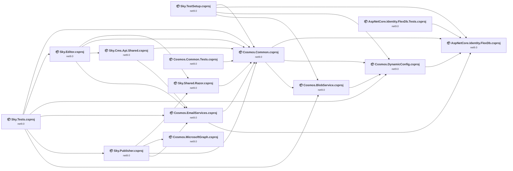

## Project Details

### AspNetCore.Identity.FlexDb.Tests\AspNetCore.Identity.FlexDb.Tests.csproj

#### Project Info

- **Current Target Framework:** net9.0
- **Proposed Target Framework:** net10.0
- **SDK-style**: True
- **Project Kind:** DotNetCoreApp
- **Dependencies**: 1
- **Dependants**: 0
- **Number of Files**: 19
- **Number of Files with Incidents**: 2
- **Lines of Code**: 5804
- **Estimated LOC to modify**: 1+ (at least 0.0% of the project)

#### Dependency Graph

Legend:
📦 SDK-style project
⚙️ Classic project

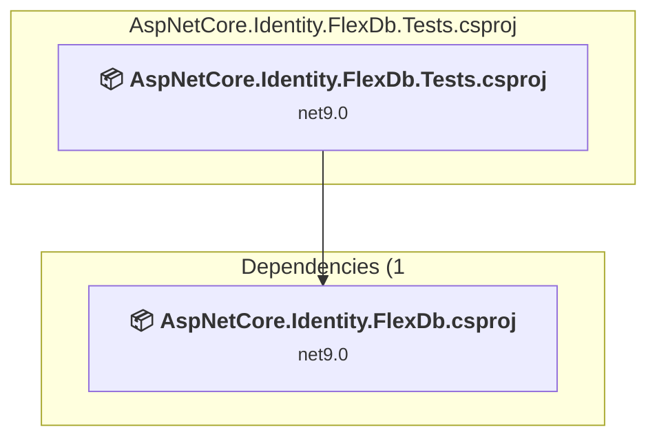

### API Compatibility

| Category | Count | Impact |
| :--- | :---: | :--- |
| 🔴 Binary Incompatible | 0 | High - Require code changes |
| 🟡 Source Incompatible | 1 | Medium - Needs re-compilation and potential conflicting API error fixing |
| 🔵 Behavioral change | 0 | Low - Behavioral changes that may require testing at runtime |
| ✅ Compatible | 8868 |  |
| ***Total APIs Analyzed*** | ***8869*** |  |

### AspNetCore.Identity.FlexDb\AspNetCore.Identity.FlexDb.csproj

#### Project Info

- **Current Target Framework:** net9.0
- **Proposed Target Framework:** net10.0
- **SDK-style**: True
- **Project Kind:** ClassLibrary
- **Dependencies**: 0
- **Dependants**: 5
- **Number of Files**: 29
- **Number of Files with Incidents**: 5
- **Lines of Code**: 3638
- **Estimated LOC to modify**: 4+ (at least 0.1% of the project)

#### Dependency Graph

Legend:
📦 SDK-style project
⚙️ Classic project

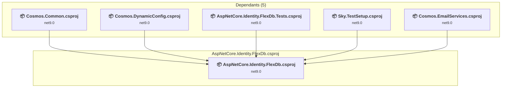

### API Compatibility

| Category | Count | Impact |
| :--- | :---: | :--- |
| 🔴 Binary Incompatible | 0 | High - Require code changes |
| 🟡 Source Incompatible | 4 | Medium - Needs re-compilation and potential conflicting API error fixing |
| 🔵 Behavioral change | 0 | Low - Behavioral changes that may require testing at runtime |
| ✅ Compatible | 3131 |  |
| ***Total APIs Analyzed*** | ***3135*** |  |

### Common.Tests\Cosmos.Common.Tests.csproj

#### Project Info

- **Current Target Framework:** net9.0
- **Proposed Target Framework:** net10.0
- **SDK-style**: True
- **Project Kind:** DotNetCoreApp
- **Dependencies**: 1
- **Dependants**: 0
- **Number of Files**: 47
- **Number of Files with Incidents**: 18
- **Lines of Code**: 11379
- **Estimated LOC to modify**: 35+ (at least 0.3% of the project)

#### Dependency Graph

Legend:
📦 SDK-style project
⚙️ Classic project

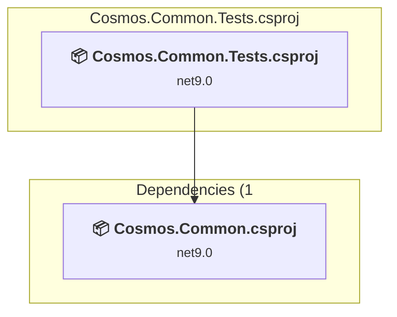

### API Compatibility

| Category | Count | Impact |
| :--- | :---: | :--- |
| 🔴 Binary Incompatible | 0 | High - Require code changes |
| 🟡 Source Incompatible | 35 | Medium - Needs re-compilation and potential conflicting API error fixing |
| 🔵 Behavioral change | 0 | Low - Behavioral changes that may require testing at runtime |
| ✅ Compatible | 12193 |  |
| ***Total APIs Analyzed*** | ***12228*** |  |

### Common\Cosmos.Common.csproj

#### Project Info

- **Current Target Framework:** net9.0
- **Proposed Target Framework:** net10.0
- **SDK-style**: True
- **Project Kind:** ClassLibrary
- **Dependencies**: 3
- **Dependants**: 8
- **Number of Files**: 155
- **Number of Files with Incidents**: 7
- **Lines of Code**: 11606
- **Estimated LOC to modify**: 25+ (at least 0.2% of the project)

#### Dependency Graph

Legend:
📦 SDK-style project
⚙️ Classic project

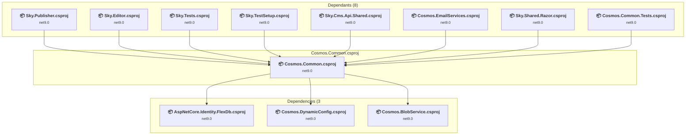

### API Compatibility

| Category | Count | Impact |
| :--- | :---: | :--- |
| 🔴 Binary Incompatible | 19 | High - Require code changes |
| 🟡 Source Incompatible | 1 | Medium - Needs re-compilation and potential conflicting API error fixing |
| 🔵 Behavioral change | 5 | Low - Behavioral changes that may require testing at runtime |
| ✅ Compatible | 7840 |  |
| ***Total APIs Analyzed*** | ***7865*** |  |

### Cosmos.BlobService\Cosmos.BlobService.csproj

#### Project Info

- **Current Target Framework:** net9.0
- **Proposed Target Framework:** net10.0
- **SDK-style**: True
- **Project Kind:** ClassLibrary
- **Dependencies**: 1
- **Dependants**: 3
- **Number of Files**: 30
- **Number of Files with Incidents**: 6
- **Lines of Code**: 5236
- **Estimated LOC to modify**: 13+ (at least 0.2% of the project)

#### Dependency Graph

Legend:
📦 SDK-style project
⚙️ Classic project

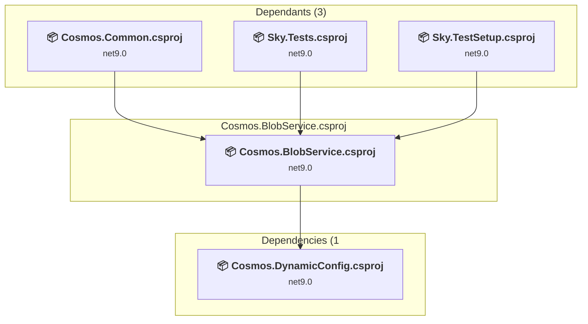

### API Compatibility

| Category | Count | Impact |
| :--- | :---: | :--- |
| 🔴 Binary Incompatible | 2 | High - Require code changes |
| 🟡 Source Incompatible | 4 | Medium - Needs re-compilation and potential conflicting API error fixing |
| 🔵 Behavioral change | 7 | Low - Behavioral changes that may require testing at runtime |
| ✅ Compatible | 4223 |  |
| ***Total APIs Analyzed*** | ***4236*** |  |

### Cosmos.ConnectionStrings\Cosmos.DynamicConfig.csproj

#### Project Info

- **Current Target Framework:** net9.0
- **Proposed Target Framework:** net10.0
- **SDK-style**: True
- **Project Kind:** ClassLibrary
- **Dependencies**: 1
- **Dependants**: 4
- **Number of Files**: 12
- **Number of Files with Incidents**: 4
- **Lines of Code**: 1502
- **Estimated LOC to modify**: 33+ (at least 2.2% of the project)

#### Dependency Graph

Legend:
📦 SDK-style project
⚙️ Classic project

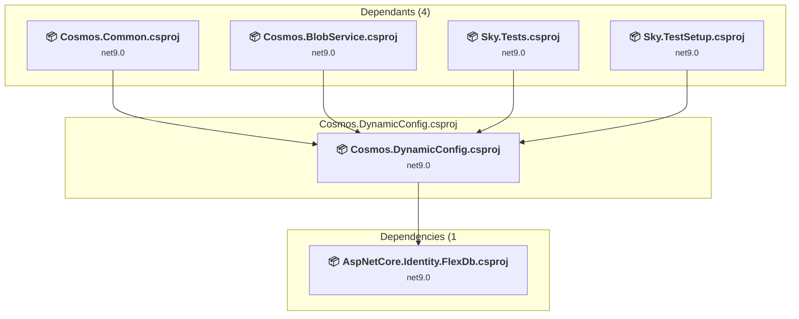

### API Compatibility

| Category | Count | Impact |
| :--- | :---: | :--- |
| 🔴 Binary Incompatible | 2 | High - Require code changes |
| 🟡 Source Incompatible | 20 | Medium - Needs re-compilation and potential conflicting API error fixing |
| 🔵 Behavioral change | 11 | Low - Behavioral changes that may require testing at runtime |
| ✅ Compatible | 1334 |  |
| ***Total APIs Analyzed*** | ***1367*** |  |

### Cosmos.EmailServices\Cosmos.EmailServices.csproj

#### Project Info

- **Current Target Framework:** net9.0
- **Proposed Target Framework:** net10.0
- **SDK-style**: True
- **Project Kind:** ClassLibrary
- **Dependencies**: 2
- **Dependants**: 4
- **Number of Files**: 17
- **Number of Files with Incidents**: 4
- **Lines of Code**: 1685
- **Estimated LOC to modify**: 4+ (at least 0.2% of the project)

#### Dependency Graph

Legend:
📦 SDK-style project
⚙️ Classic project

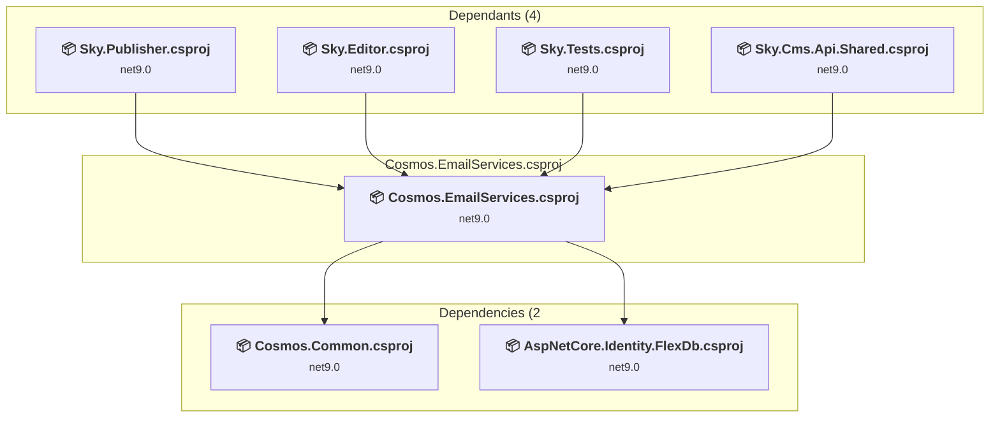

### API Compatibility

| Category | Count | Impact |
| :--- | :---: | :--- |
| 🔴 Binary Incompatible | 1 | High - Require code changes |
| 🟡 Source Incompatible | 0 | Medium - Needs re-compilation and potential conflicting API error fixing |
| 🔵 Behavioral change | 3 | Low - Behavioral changes that may require testing at runtime |
| ✅ Compatible | 1365 |  |
| ***Total APIs Analyzed*** | ***1369*** |  |

### Cosmos.MicrosoftGraph\Cosmos.MicrosoftGraph.csproj

#### Project Info

- **Current Target Framework:** net9.0
- **Proposed Target Framework:** net10.0
- **SDK-style**: True
- **Project Kind:** ClassLibrary
- **Dependencies**: 0
- **Dependants**: 1
- **Number of Files**: 8
- **Number of Files with Incidents**: 3
- **Lines of Code**: 623
- **Estimated LOC to modify**: 19+ (at least 3.0% of the project)

#### Dependency Graph

Legend:
📦 SDK-style project
⚙️ Classic project

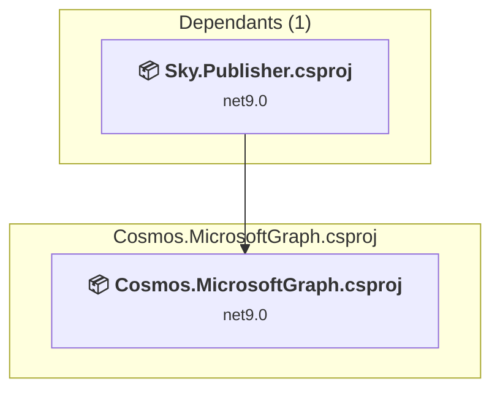

### API Compatibility

| Category | Count | Impact |
| :--- | :---: | :--- |
| 🔴 Binary Incompatible | 11 | High - Require code changes |
| 🟡 Source Incompatible | 0 | Medium - Needs re-compilation and potential conflicting API error fixing |
| 🔵 Behavioral change | 8 | Low - Behavioral changes that may require testing at runtime |
| ✅ Compatible | 423 |  |
| ***Total APIs Analyzed*** | ***442*** |  |

### Editor\Sky.Editor.csproj

#### Project Info

- **Current Target Framework:** net9.0
- **Proposed Target Framework:** net10.0
- **SDK-style**: True
- **Project Kind:** AspNetCore
- **Dependencies**: 4
- **Dependants**: 1
- **Number of Files**: 655
- **Number of Files with Incidents**: 34
- **Lines of Code**: 96674
- **Estimated LOC to modify**: 220+ (at least 0.2% of the project)

#### Dependency Graph

Legend:
📦 SDK-style project
⚙️ Classic project

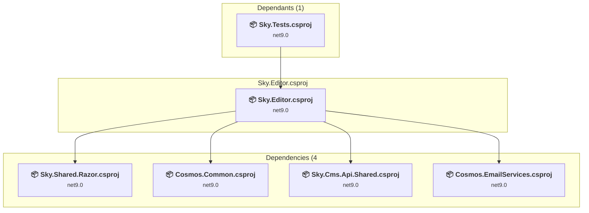

### API Compatibility

| Category | Count | Impact |
| :--- | :---: | :--- |
| 🔴 Binary Incompatible | 45 | High - Require code changes |
| 🟡 Source Incompatible | 112 | Medium - Needs re-compilation and potential conflicting API error fixing |
| 🔵 Behavioral change | 63 | Low - Behavioral changes that may require testing at runtime |
| ✅ Compatible | 129311 |  |
| ***Total APIs Analyzed*** | ***129531*** |  |

#### Project Technologies and Features

| Technology | Issues | Percentage | Migration Path |
| :--- | :---: | :---: | :--- |
| GDI+ / System.Drawing | 81 | 36.8% | System.Drawing APIs for 2D graphics, imaging, and printing that are available via NuGet package System.Drawing.Common. Note: Not recommended for server scenarios due to Windows dependencies; consider cross-platform alternatives like SkiaSharp or ImageSharp for new code. |

### Publisher\Sky.Publisher.csproj

#### Project Info

- **Current Target Framework:** net9.0
- **Proposed Target Framework:** net10.0
- **SDK-style**: True
- **Project Kind:** AspNetCore
- **Dependencies**: 4
- **Dependants**: 1
- **Number of Files**: 135
- **Number of Files with Incidents**: 8
- **Lines of Code**: 7268
- **Estimated LOC to modify**: 28+ (at least 0.4% of the project)

#### Dependency Graph

Legend:
📦 SDK-style project
⚙️ Classic project

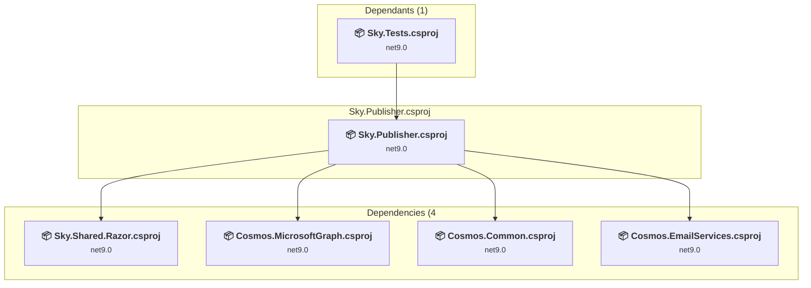

### API Compatibility

| Category | Count | Impact |
| :--- | :---: | :--- |
| 🔴 Binary Incompatible | 11 | High - Require code changes |
| 🟡 Source Incompatible | 14 | Medium - Needs re-compilation and potential conflicting API error fixing |
| 🔵 Behavioral change | 3 | Low - Behavioral changes that may require testing at runtime |
| ✅ Compatible | 20629 |  |
| ***Total APIs Analyzed*** | ***20657*** |  |

### Sky.Cms.Api.Shared\Sky.Cms.Api.Shared.csproj

#### Project Info

- **Current Target Framework:** net9.0
- **Proposed Target Framework:** net10.0
- **SDK-style**: True
- **Project Kind:** AspNetCore
- **Dependencies**: 2
- **Dependants**: 1
- **Number of Files**: 15
- **Number of Files with Incidents**: 4
- **Lines of Code**: 1854
- **Estimated LOC to modify**: 7+ (at least 0.4% of the project)

#### Dependency Graph

Legend:
📦 SDK-style project
⚙️ Classic project

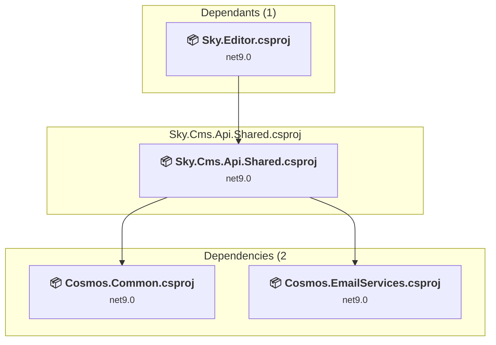

### API Compatibility

| Category | Count | Impact |
| :--- | :---: | :--- |
| 🔴 Binary Incompatible | 1 | High - Require code changes |
| 🟡 Source Incompatible | 1 | Medium - Needs re-compilation and potential conflicting API error fixing |
| 🔵 Behavioral change | 5 | Low - Behavioral changes that may require testing at runtime |
| ✅ Compatible | 1026 |  |
| ***Total APIs Analyzed*** | ***1033*** |  |

### Sky.Shared.Razor\Sky.Shared.Razor.csproj

#### Project Info

- **Current Target Framework:** net9.0
- **Proposed Target Framework:** net10.0
- **SDK-style**: True
- **Project Kind:** ClassLibrary
- **Dependencies**: 1
- **Dependants**: 2
- **Number of Files**: 10
- **Number of Files with Incidents**: 1
- **Lines of Code**: 559
- **Estimated LOC to modify**: 0+ (at least 0.0% of the project)

#### Dependency Graph

Legend:
📦 SDK-style project
⚙️ Classic project

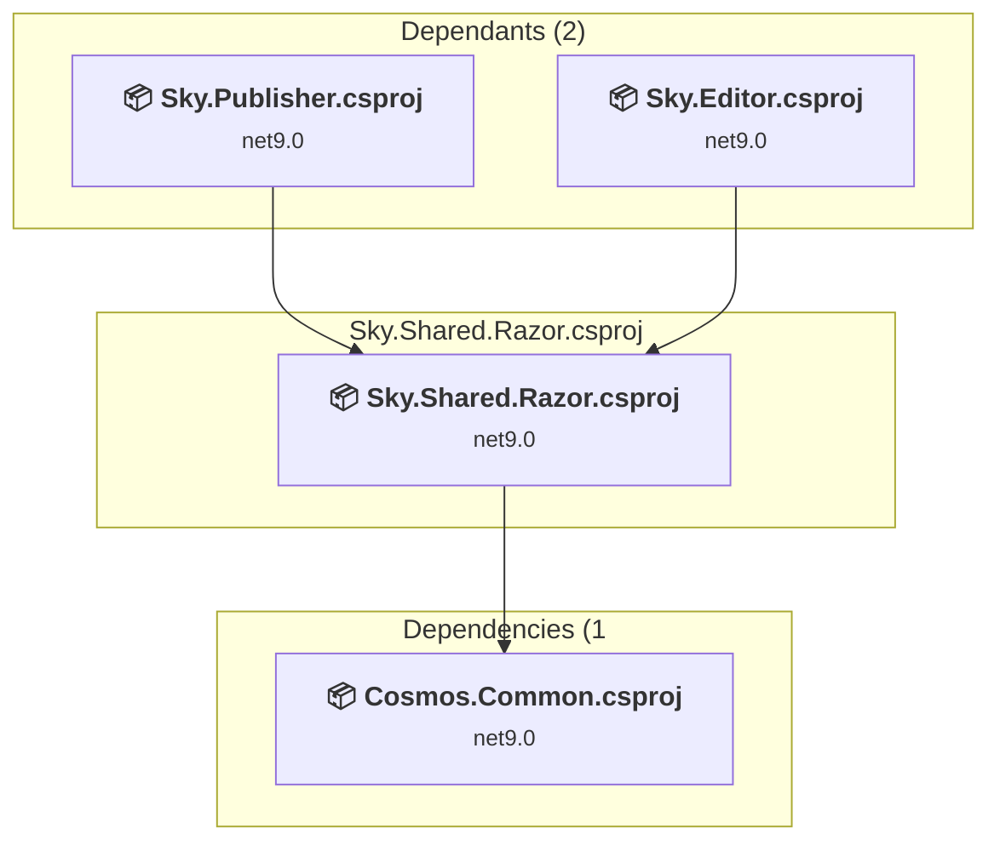

### API Compatibility

| Category | Count | Impact |
| :--- | :---: | :--- |
| 🔴 Binary Incompatible | 0 | High - Require code changes |
| 🟡 Source Incompatible | 0 | Medium - Needs re-compilation and potential conflicting API error fixing |
| 🔵 Behavioral change | 0 | Low - Behavioral changes that may require testing at runtime |
| ✅ Compatible | 1497 |  |
| ***Total APIs Analyzed*** | ***1497*** |  |

### Sky.TestSetup\Sky.TestSetup.csproj

#### Project Info

- **Current Target Framework:** net9.0
- **Proposed Target Framework:** net10.0
- **SDK-style**: True
- **Project Kind:** DotNetCoreApp
- **Dependencies**: 4
- **Dependants**: 0
- **Number of Files**: 4
- **Number of Files with Incidents**: 1
- **Lines of Code**: 547
- **Estimated LOC to modify**: 0+ (at least 0.0% of the project)

#### Dependency Graph

Legend:
📦 SDK-style project
⚙️ Classic project

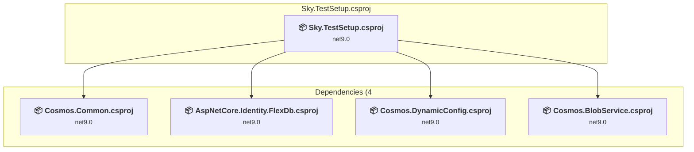

### API Compatibility

| Category | Count | Impact |
| :--- | :---: | :--- |
| 🔴 Binary Incompatible | 0 | High - Require code changes |
| 🟡 Source Incompatible | 0 | Medium - Needs re-compilation and potential conflicting API error fixing |
| 🔵 Behavioral change | 0 | Low - Behavioral changes that may require testing at runtime |
| ✅ Compatible | 636 |  |
| ***Total APIs Analyzed*** | ***636*** |  |

### Tests\Sky.Tests.csproj

#### Project Info

- **Current Target Framework:** net9.0
- **Proposed Target Framework:** net10.0
- **SDK-style**: True
- **Project Kind:** DotNetCoreApp
- **Dependencies**: 6
- **Dependants**: 0
- **Number of Files**: 166
- **Number of Files with Incidents**: 18
- **Lines of Code**: 80498
- **Estimated LOC to modify**: 82+ (at least 0.1% of the project)

#### Dependency Graph

Legend:
📦 SDK-style project
⚙️ Classic project

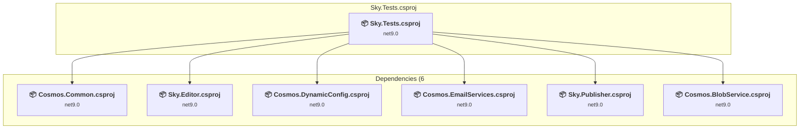

### API Compatibility

| Category | Count | Impact |
| :--- | :---: | :--- |
| 🔴 Binary Incompatible | 4 | High - Require code changes |
| 🟡 Source Incompatible | 20 | Medium - Needs re-compilation and potential conflicting API error fixing |
| 🔵 Behavioral change | 58 | Low - Behavioral changes that may require testing at runtime |
| ✅ Compatible | 85725 |  |
| ***Total APIs Analyzed*** | ***85807*** |  |

