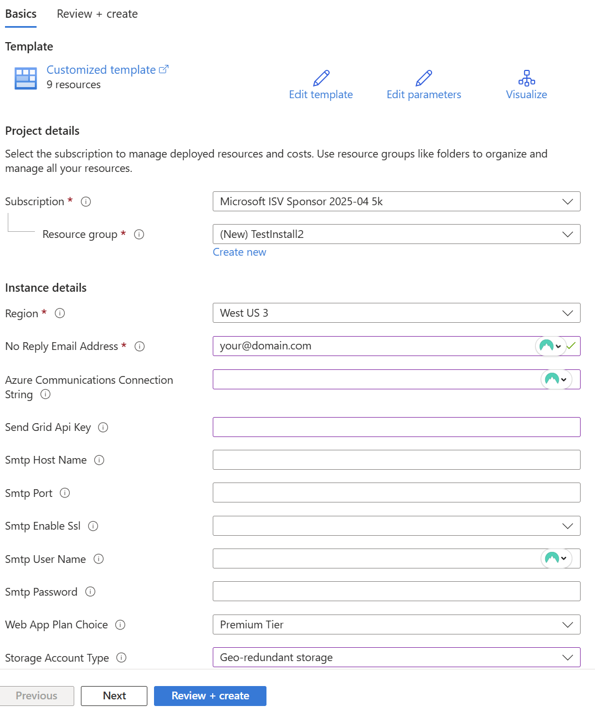

# Installing SkyCMS on Azure

The following describes how to install SkyCMS on Microsoft Azure.

## Quick Installation using Deploy Button

The easiest way to install SkyCMS is using the Deploy button located in the main README.md file.

### Prerequisites

- An Azure subscription (Get one free)

### Installation Steps

1. **Navigate to the Repository**
    - Go to the SkyCMS repository on GitHub.
    - Locate the main README.md file.

2. **Click the Deploy Button**
    - Find the "Deploy to Azure" button in the README.md.
    - Click the button to start the deployment process.

3. **Configure Deployment**
    - You'll be redirected to the Azure portal.
    - Sign in with your Azure credentials if prompted.
    - Select your Azure subscription.
    - Choose or create a resource group.
    - Add an administrator email address. This can be yours.
    - Add an email provider information (optional for dev/test)
    - Choose basic or premium app plan.
    - Choose locally or geographically redundant storage.
    - Click "Review + create."

1. **Deploy**
    - Review your configuration settings
    - Click "Deploy" to start the installation
    - Wait for the deployment to complete

2. **Access Your Installation**
    - Once deployment is finished, open the resource groups where you installed Sky.
    - Find the editor web app. The name prefix will start with "ed".
    - Follow the directions for creating a user account.
    - Then select a website design and first home page.
    - At your website's home page, select the "Menu" button, then "Public Website".

### Next Steps

After successful deployment:
- Configure your CMS settings
- Set up user accounts
- Begin creating content

### Clean Up

If SkyCMS was created in a new Resource Group, simply delete the resource group to remove all Sky and all its resources.  Otherwise, using the Azure portal, delete the Sky resources there.

For additional configuration options and troubleshooting, refer to the documentation in the `/docs` folder.
