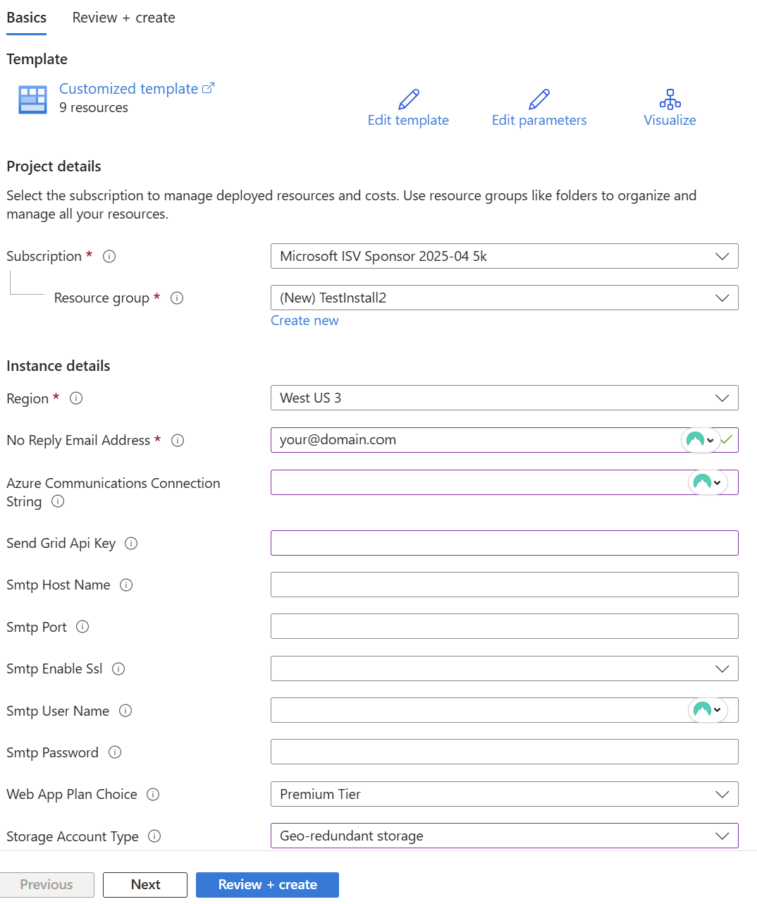

# Installing SkyCMS on Azure

The following describes how to install SkyCMS on Microsoft Azure.

## When to use this
- You want the fastest path to deploy SkyCMS on Azure using the Deploy button.
- You prefer managed Azure services and a guided post-deploy setup (wizard).

## Why this matters
- One-click deploy reduces manual Azure setup and misconfiguration risk.
- Clear prerequisites and steps avoid stalled deployments and missing resources.

## Key takeaways
- Use the Deploy button for quick starts; wizard handles single-tenant setup.
- Multi-tenant/production can deploy from the template but should keep `CosmosAllowSetup=false` and use DynamicConfig.
- Ensure Azure subscription, resource group, and basic permissions before starting.

## Prerequisites
- Azure subscription with rights to deploy the template and create App Service + storage.
- Admin email for setup; optional email provider details if configuring during wizard.

## Quick path
1. Click Deploy to Azure (from README) and provision the template.
2. After deploy, browse to the Editor app and run `/___setup` (single-tenant wizard).
3. Finish wizard, restart automatically, sign in, and publish first page.

## Quick Installation using Deploy Button

The easiest way to install SkyCMS is using the Deploy button located in the main README.md file.

### Prerequisites

- An Azure subscription ([Get one free](https://azure.microsoft.com/en-us/pricing/purchase-options/azure-account/))

### Installation Steps

1. **Navigate to the Repository**
    - Go to the SkyCMS repository on GitHub.
    - Locate the main README.md file.

2. **Click the Deploy Button**
    - Find the "Deploy to Azure" button in the README.md.
    - Click the button to start the deployment process.

3. **Configure Deployment**
    - You'll be redirected to the Azure portal.
    - Sign in with your Azure credentials if prompted.
    - Select your Azure subscription.
    - Choose or create a resource group.
    - Add an administrator email address. This can be yours.
    - Add an email provider information (optional for dev/test)
    - Choose basic or premium app plan.
    - Choose locally or geographically redundant storage.
    - Click "Review + create."

1. **Deploy**
    - Review your configuration settings
    - Click "Deploy" to start the installation
    - Wait for the deployment to complete

2. **Access Your Installation**
    - Once deployment is finished, open the resource group where you installed SkyCMS.
    - Find the App Service web app. The name will include "editor" in the prefix.
    - The health check (`/___healthz`) ensures the app is ready within 30-60 seconds.
    - Browse to `https://<your-editor>.azurewebsites.net/___setup` and run the **single-tenant setup wizard** (enabled via `CosmosAllowSetup=true`). Multi-tenant deployments should leave this flag false and use DynamicConfig instead.
    - Wizard steps: Storage → Admin account → Publisher URL/title/layout → (optional) Email provider → (optional) CDN → Review & Complete. It validates storage and database connectivity and creates the first Administrator user.
    - After finishing the wizard, the app will automatically restart and apply the new configuration.
    - Sign in with the admin email/password you specified.
    - Create your first page and choose a starter design.
    - At your website's home page, select the "Menu" button, then "Public Website".

### Next Steps

After successful deployment:
- Configure your CMS settings
- Set up user accounts
- Begin creating content

### Related Documentation

- **[Installation Overview](./README.md)** - Choose your deployment platform
- **[Minimum Required Settings](./MinimumRequiredSettings.md)** - Configuration essentials
- **[Storage Configuration](../Configuration/Storage-Overview.md)** - Configure Azure Blob, AWS S3, or Cloudflare R2 storage
- **[Storage Config Reference](../Configuration/Storage-Configuration-Reference.md)** - Settings, defaults, and examples
- **[Database Configuration](../Configuration/Database-Overview.md)** - Database provider setup (Cosmos DB, SQL Server, MySQL)
- **[Database Config Reference](../Configuration/Database-Configuration-Reference.md)** - Connection strings and provider options
- **[Cloudflare Edge Hosting](./CloudflareEdgeHosting.md)** - Deploy origin-less static sites with Cloudflare R2
- **[Quick Start Guide](../QuickStart.md)** - Get started quickly
- **[Main Documentation Hub](../index.md)** - Browse all SkyCMS documentation

### Clean Up

If SkyCMS was created in a new Resource Group, simply delete the resource group to remove all Sky and all its resources.  Otherwise, using the Azure portal, delete the Sky resources there.

For additional configuration options and troubleshooting, refer to the documentation in the `/docs` folder.
